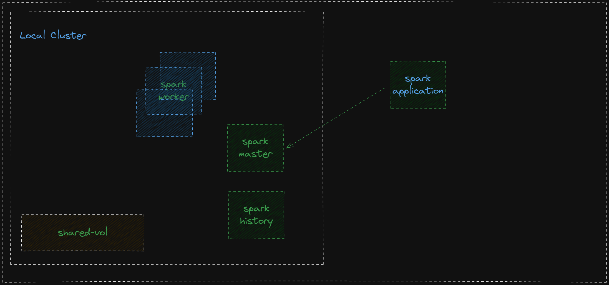

# application
# application
* Ingest csv files w/w.o headers
* Append two colums to the output dataframe
  * ingestion_tms (YYYY-MM-DD HH:mm:SS)
  * use append mode to automatically append new data to delta table

# install requirements
python3.10 -m pip install -r spark/requirements.txt

# run unit tests
python3.10 -m pytest

# source the environment
source start.sh

# run local spark cluster single worker single master
docker compose up -d

# dockerize the application
docker build -t obn/spark-delta-plateform:0.0.1 spark/

# submit the spark job to the local cluster
docker run --rm --network spark-delta-plateform_default --name pyspark-example obn/spark-delta-plateform:0.0.1

# clean up local cluster
docker compose down

# docs & links
[delta lake](https://docs.delta.io/1.2.1/quick-start.html)

[big data europe 2020](https://github.com/big-data-europe)

[docker](https://docs.docker.com/reference/cli/docker/)

# architecture
