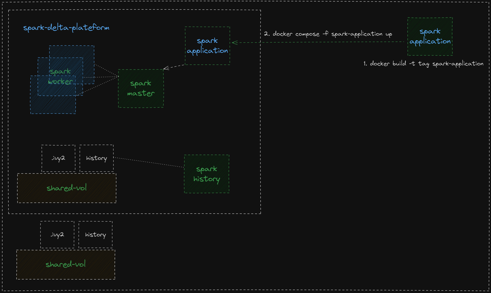

# spark-delta-plateform
A ready to go environment for people experimenting with Apache Spark and Delta.

# example use case
* Ingest csv files w/w.o headers
* Append two colums to the output dataframe
  * ingestion_tms (YYYY-MM-DD HH:mm:SS)
  * use append mode to automatically append new data to delta table

# source the environment & build the containers
source start.sh

# build the images
bash build.sh

# run local spark cluster single worker single master
docker compose -f local-cluster.yaml up -d

# dockerize the application
docker build -t oussamabennasr/spark-delta-plateform:0.0.1 spark-application/

# run unit tests
docker run --rm --network spark-delta-plateform_default --name pyspark-example --volume ./shared-vol/:/opt/workspace --volume ./shared-vol/.ivy2:/root/.ivy2 -it oussamabennasr/spark-delta-plateform:0.0.1 pytest

# submit the spark job to the local cluster
docker compose -f spark-application/app.yaml up

# clean up local cluster
docker compose -f local-cluster.yaml down

# architecture

# docs & links
[delta lake](https://docs.delta.io/3.1.0/quick-start.html)

[big data europe 2020](https://github.com/big-data-europe)

[docker](https://docs.docker.com/reference/cli/docker/)

[spark-optimization](https://github.com/ivanovro/spark-optimization)

